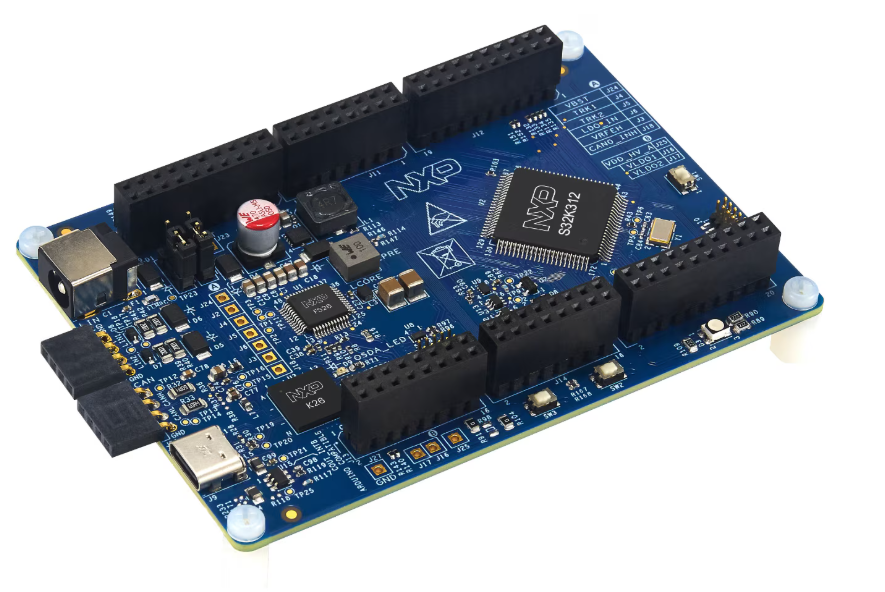
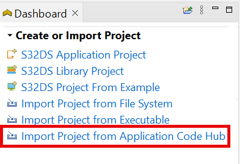
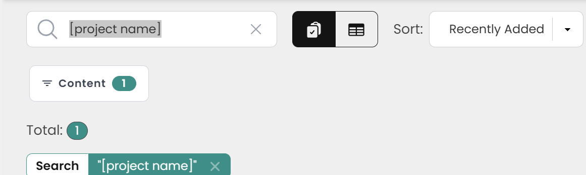
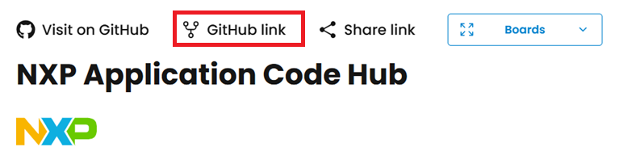
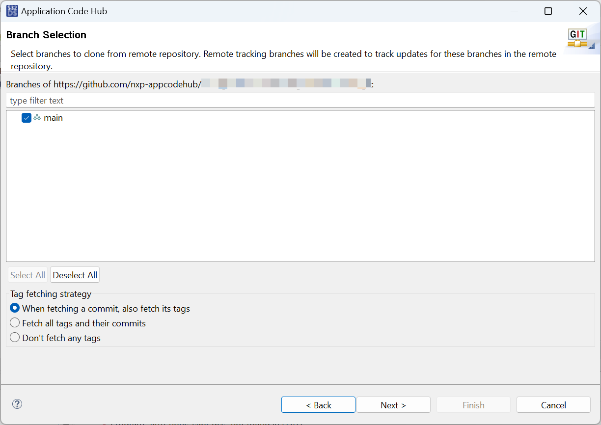
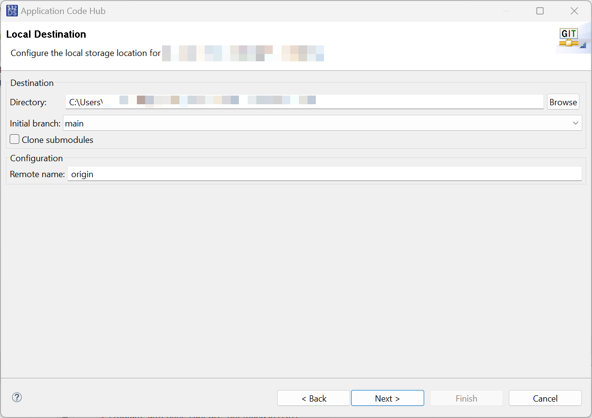
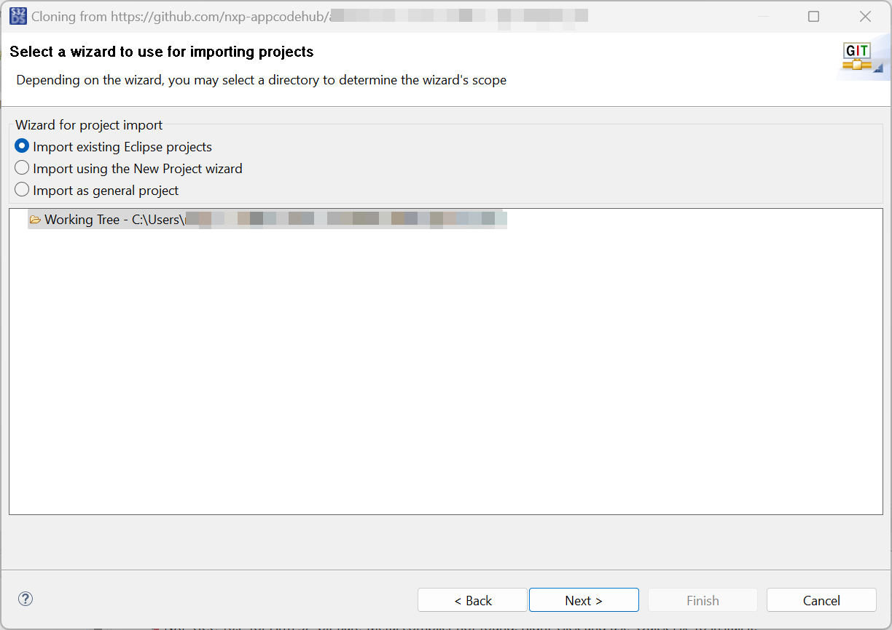
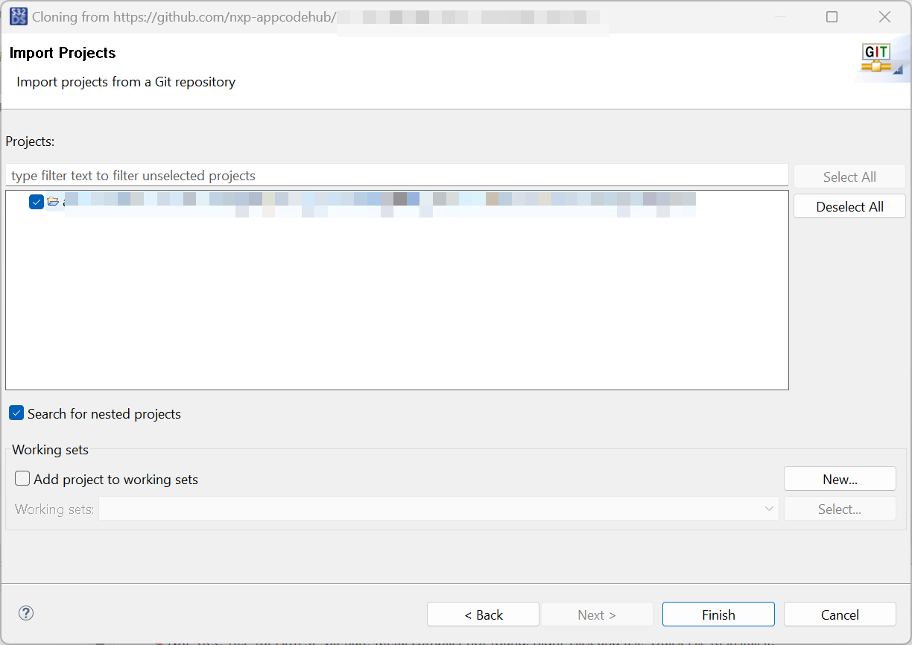
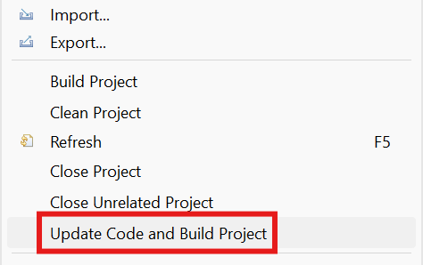
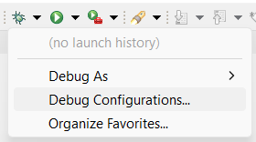

# NXP Application Code Hub

## UART Communication and LED  Example on FRDM-Auto-S32K312
This demo shows how to create a USB-UART serial console and basic LED control on the FRDM S32K312 board. The application provides a text-based UART console with simple commands and also supports LED control via onboard buttons.

#### Boards: FRDM S32K312
#### Categories: Communication, GPIO
#### Peripherals: LPUART, GPIO
#### Toolchains: S32 Design Studio IDE

## Table of Contents
1. [Software](#step1)
2. [Hardware](#step2)
3. [Setup](#step3)
4. [Results](#step4)
5. [Support](#step6)
6. [Release Notes](#step7)

## 1. Software
- [S32 Design Studio IDE v3.6.5 or later](https://www.nxp.com/design/design-center/software/automotive-software-and-tools/s32-design-studio-ide/s32-design-studio-for-s32-platform:S32DS-S32PLATFORM)
- [S32K3_S32M27x Real-Time Drivers ASR R23-11 Version 7.0.0](https://www.nxp.com/design/design-center/software/automotive-software-and-tools/real-time-drivers-rtd:AUTOMOTIVE-RTD)
- Serial terminal program (for example: PuTTy, Tera Term etc.)

## 2. Hardware
- Type-C USB cable
- Personal Computer
- 1 Power Adapter 12V
- [FRDM S32K312](https://www.nxp.com/design/design-center/development-boards-and-designs/S32K312MINI-EVB)[

](images/S32K312MINI-EVB.png)

## 3. Setup
### 3.1 Import the project to S32 Design Studio IDE

1. Open S32 Design Studio IDE, in the Dashboard Panel, choose **Import project from Application Code Hub**.
   ​	[

](./images/import_project_1.png)

2. You can find the demo you need by searching for the name directly. Open the project, click the **GitHub link**, S32 Design Studio IDE will automatically retrieve project attributes then click **Next>**.
    [

](./images/import_project_2.png) 
    [

](./images/import_project_3.png) 

3. Select **main** branch and then click **Next>**.
   ​	[

](./images/import_project_4.png)

4. Select your local path for the repo in **Destination->Directory** window. The S32 Design Studio IDE will clone the repo into this path, click **Next>**.
      [

](./images/import_project_5.png)

5. Select **Import existing Eclipse projects** then click **Next>**.
      [

](./images/import_project_6.png)

6. Select the project in this repo (only one project in this repo) then click **Finish**.
      [

](./images/import_project_7.png)

### 3.2 Generating, building and running the example application
1. In Project Explorer, right-click the project and select **Update Code and Build Project**. This will generate the configuration (Pins, Clocks, Peripherals), update the source code and build the project using the active configuration (e.g. Debug_FLASH).
Make sure the build completes successfully and the *.elf file is generated without errors.
[

](./images/update_and_build.png)
Press **Yes** in the **SDK Component Management** pop-up window to continue.

2. Go to **Debug** and select **Debug Configurations**. There will be a debug configuration for this project:
[

](./images/Debug_config.png)

        Configuration Name                  Description
        -------------------------------     -----------------------
        $(example)_debug_flash_pemicro      Debug the FLASH configuration using PEmicro probe

    Select the desired debug configuration and click on **Debug**. Now the perspective will change to the **Debug Perspective**.
    Use the controls to control the program flow.

## 4. Results
Open a serial terminal on the enumerated COM port (typical settings: 115200 baud, 8 data bits, no parity, 1 stop bit, no flow control). Press enter to display the prompt. 
Supported commands: 
    Help – displays the list of available commands
    Led on – turns the Green LED on 
    Led off – turns the Green LED off 
    Status – prints the current Green LED state

Button control:
Onboard buttons control Green LED ON/OFF functionality (as defined by the board mapping) 
The Blue LED indicates UART activity or command handling (for example, toggles briefly on RX/TX or on command parse). 

## 5. Support
*Provide URLs for help here.*

#### Project Metadata

<!----- Boards ----->

<!----- Peripherals ----->

<!----- Toolchains ----->

Questions regarding the content/correctness of this example can be entered as Issues within this GitHub repository.

>**Warning**: For more general technical questions regarding NXP Microcontrollers and the difference in expected functionality, enter your questions on the [NXP Community Forum](https://community.nxp.com/)

## 6. Release Notes
| Version | Description / Update                           | Date                        |
|:-------:|------------------------------------------------|----------------------------:|
| 1.0     | Initial release on Application Code Hub        |February 17th 2026|

